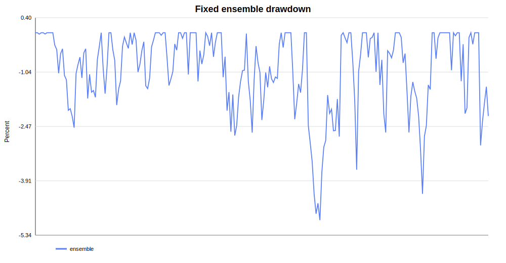
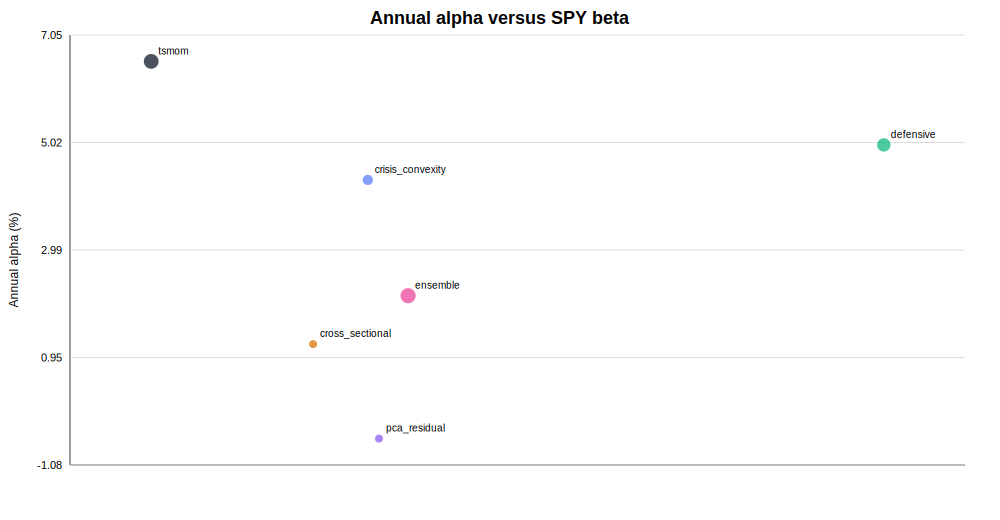
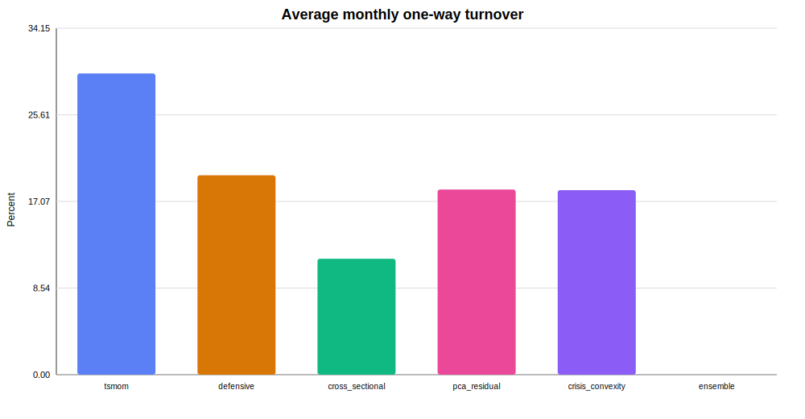

# Institutional alpha research — LSE expansion branch

Generated on 23 July 2026.

## Status

This branch replaces Manifold-dependent plotting and prepares a strict London Strategic Edge research campaign. Every chart is generated directly from numerical return series. No Manifold chart payload is required.

**No live deployment is authorised.** The current fixed ensemble is a research candidate, not yet independently validated alpha.

## Security model

- `LSE_API_KEY` is read only from the process environment.
- The key is never accepted as a CLI argument, config value, report field or artifact input.
- All LSE errors are redacted before they can reach logs.
- Every result directory is scanned for the `lse_live_` prefix before artifact upload.
- Strict LSE mode has no Yahoo, Stooq or Manifold fallback.
- The authenticated workflow runs only by manual dispatch.

## Frozen professional hypotheses

The full definitions and validation gates are committed in [`LSE_HYPOTHESES.json`](LSE_HYPOTHESES.json) before authenticated data access.

1. multi-horizon futures trend;
2. futures curve carry and roll-down;
3. COT commercial-pressure relative value;
4. G10 FX yield carry and valuation;
5. index variance risk premium;
6. index-versus-constituent dispersion;
7. macro-surprise cross-asset relative value.

There are no ICT/SMC concepts, chart patterns, order blocks or discretionary labels. The campaign is based on economic risk premia, relative value, positioning and publication-time-aligned event information.

## Immediate non-LSE benchmark

The existing audited daily-price panel was used only to validate the independent engine and plotting path. The following five sleeves were fixed without a parameter search:

- multi-horizon time-series momentum;
- defensive inverse-volatility allocation;
- class-neutral cross-sectional momentum;
- rolling PCA residual trend;
- systematic crisis-convexity overlay.

They are combined using lagged inverse sleeve volatility with a fixed 35% sleeve cap. Signals are delayed by one full month. One-way costs are 5 bps for non-crypto assets and 10 bps for crypto. Crypto gross exposure is capped at 15%, each instrument at 25%, and total gross at 150%.

### Fixed ensemble

| Period | Observations | Sharpe | Annual return | Alpha | Alpha t-stat | SPY beta | Correlation | Max drawdown |
|---|---:|---:|---:|---:|---:|---:|---:|---:|
| Development 2007–2022 | 192 | 0.698 | 2.15% | 1.91% | 3.20 | 0.025 | 0.129 | -4.95% |
| Already-consumed 2023 onward | 43 | 1.021 | 4.06% | 2.41% | 1.26 | 0.079 | 0.253 | -2.99% |
| Full history | 235 | 0.767 | 2.50% | 2.12% | 3.47 | 0.033 | 0.154 | -4.95% |

Full-history circular-block-bootstrap p-value: **0.00025**. Max-Sharpe block-bootstrap correction across the six reported portfolios: **0.0010**.

These values show that the engine can construct a low-beta, low-drawdown portfolio. They do **not** prove fresh alpha because:

- the 2023–2026 window has already been inspected;
- only 43 monthly observations are available in that segment;
- the segment alpha t-stat is 1.26, below the required 2.0;
- the source panel does not contain futures curves, COT, historical option surfaces or timestamped macro surprises.

The strategy is therefore a frozen candidate for independent LSE replication, not a result to tune further.

## Standalone plots committed to Git

These SVG files contain their own paths and text. They do not depend on Manifold or an external renderer.

### Fixed ensemble drawdown

### Alpha and beta map

### Actual turnover

The campaign artifact additionally contains Matplotlib PNG/SVG equity curves, rolling Sharpe and monthly heatmap generated from the saved return CSV. Those files are regenerated on every controlled run rather than represented by a remote chart payload.

## LSE campaign gates

A strategy will be labelled validated alpha only if all frozen gates pass:

- at least eight years and 1,500 daily portfolio observations;
- purged combinatorial cross-validation with a 21-session embargo;
- net Sharpe at least 0.80;
- HAC alpha t-stat at least 2.0;
- deflated-Sharpe probability at least 95%;
- probability of backtest overfitting at most 10%;
- White Reality Check or Hansen SPA p-value at most 5%;
- absolute SPY beta at most 0.10 and correlation at most 0.20;
- positive net performance with doubled costs and an extra execution delay;
- positive performance in at least 70% of chronological subperiods.

Zero overfitting cannot be proved mathematically from a finite historical sample. The defensible objective is to eliminate avoidable leakage, pre-register the hypotheses, correct for selection and reject aggressively. That is the standard applied here.
