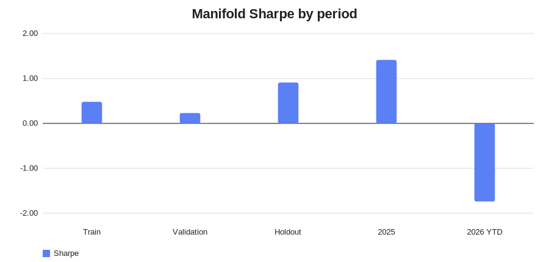
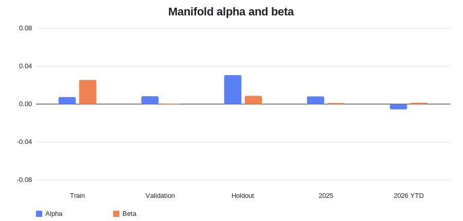
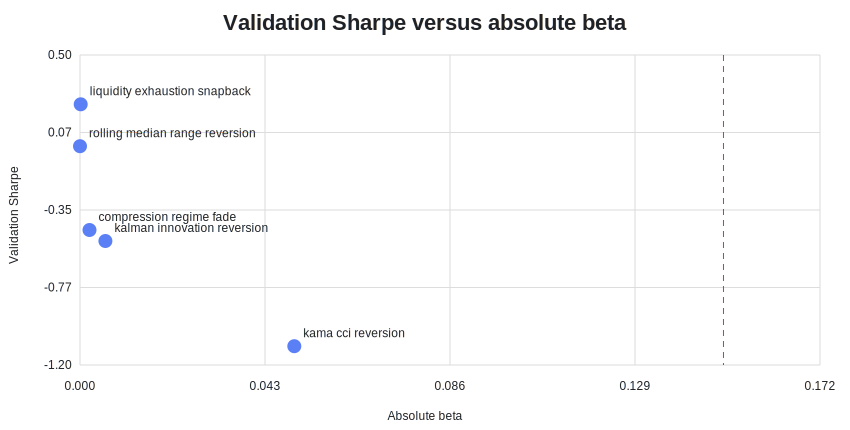
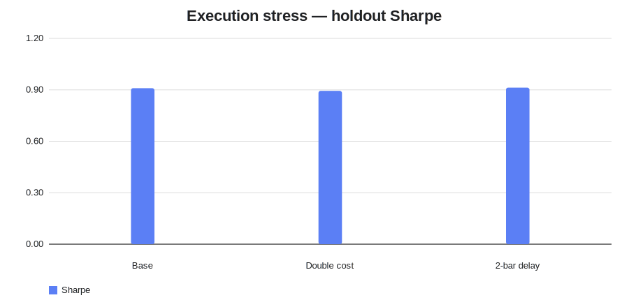

# Mean-reversion alpha research — ManifoldBT

Generated from ManifoldBT MCP on 23 July 2026.

## Verdict

**Rejected as validated alpha.** The research successfully reduced the available market-factor beta, but did not reach the required Sharpe or statistical-strength gates.

- Selected family: `liquidity_exhaustion_snapback` (4h).
- Frozen holdout Sharpe: **0.910**.
- Holdout alpha: **0.0306**.
- Holdout beta: **0.0087**.
- Alpha t-stat: **1.235**.
- Holdout return: **4.18%**.
- Maximum drawdown: **-1.28%**.
- 2026 YTD Sharpe: **-1.739**.
- Strict validation-gate passes: **0**.

The result is close to market neutral under Manifold's available beta metric, but 2026 deterioration and weak validation prevent acceptance. SPY cannot be loaded on this public MCP server, so direct S&P 500 beta is not measurable here.

## Plots

## Stress and portfolio

- Double-slippage Sharpe: `0.894`.
- Two-bar-delay Sharpe: `0.913`.
- Equal-weight three-sleeve portfolio Sharpe: `0.643`.
- Monte Carlo probability of ruin: `11.0%`.

The full raw MCP payload and nine original SVG plots remain available in GitHub Actions artifact `manifold-mean-reversion-79`.
