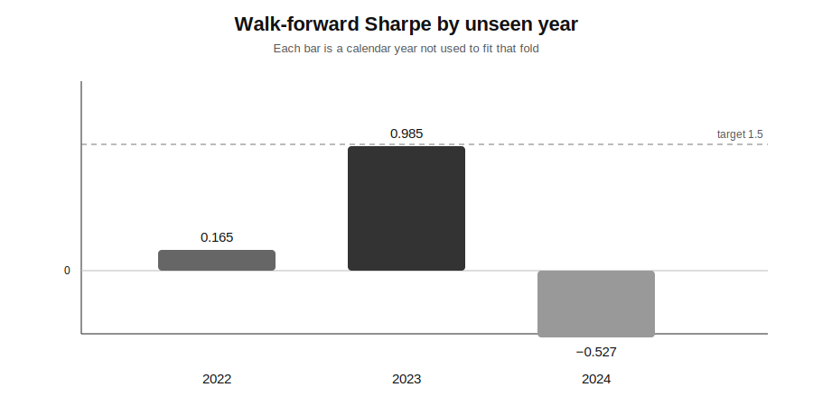
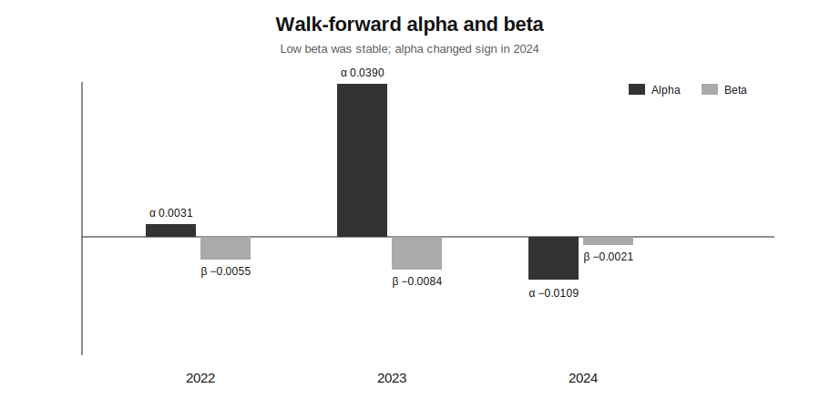
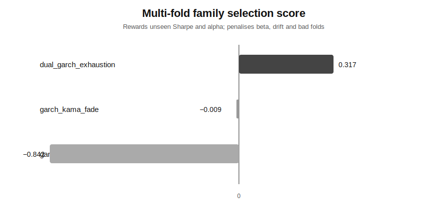
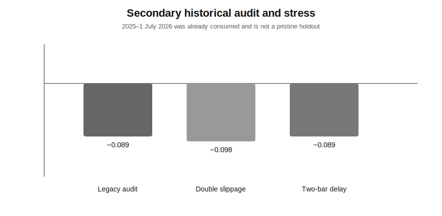
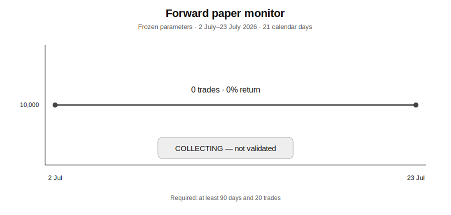

# Alpha Research — ManifoldBT MCP only

Every market calculation in the active pipeline is executed by the remote **ManifoldBT MCP engine**. Python orchestrates calls, freezes reviewed parameters and renders plots from Manifold payloads; it does not recalculate strategy performance.

## Current research direction — conditional-volatility mean reversion

The active candidate search is symmetrical long/short and aims for positive alpha with minimal exposure to Manifold's available market-factor beta.

The final protocol uses:

- five mean-reversion families with GARCH conditional-volatility regime sizing;
- 4-hour bars across ten Binance CryptoSpot proxies;
- three expanding walk-forward folds with unseen calendar years 2022, 2023 and 2024;
- Binance-perps fee preset, 3 bps slippage and one-bar `AtOpen` execution delay;
- full active-grid enumeration through Manifold `run_batch`;
- parameter consensus across folds rather than selection on the later audit period;
- a frozen forward paper monitor starting 2 July 2026.

## Reviewed result — 23 July 2026

Selected family: `dual_garch_exhaustion`.

| Unseen fold | Sharpe | Alpha | Beta | Return | Max drawdown | Trades |
|---|---:|---:|---:|---:|---:|---:|
| 2022 | 0.165 | 0.0031 | -0.0055 | +0.64% | -5.44% | 23 |
| 2023 | 0.985 | 0.0390 | -0.0084 | +3.06% | -2.17% | 44 |
| 2024 | **-0.527** | **-0.0109** | -0.0021 | **-1.31%** | -4.05% | 89 |

Aggregate:

- median unseen Sharpe: **0.165**;
- worst unseen Sharpe: **-0.527**;
- maximum absolute beta: **0.0084**;
- positive-alpha folds: **2/3**;
- total unseen trades: **156**.

**Decision: rejected as validated alpha.** The low-beta objective worked, but alpha changed sign in 2024 and the historical multi-fold gate failed.

The secondary 2025–1 July 2026 audit was also negative: Sharpe **-0.089**, alpha **-0.0021**, return **-0.23%**. That period was consumed by previous research and is not treated as a pristine holdout.

Full reviewed report: [`results/walk_forward/REPORT.md`](results/walk_forward/REPORT.md).

## Walk-forward plots

### Unseen-year Sharpe

### Unseen-year alpha and beta

### Family selection scores

### Secondary audit and execution stress

### Forward paper monitor

## Frozen paper validation

[`results/walk_forward/locked_strategy.json`](results/walk_forward/locked_strategy.json) contains the reviewed DSL specification and fixed parameters. The daily paper workflow recompiles that specification but cannot alter the values.

A strategy cannot be labelled validated until the forward window contains at least:

- 90 calendar days;
- 20 trades;
- Sharpe of 0.75 or more;
- positive alpha;
- absolute beta no greater than 0.15.

At the reviewed snapshot, the paper window contained only 21 days and zero trades, so its status is **collecting**, not validated.

## Monte Carlo risk

The 1,000-path development block bootstrap reports:

- mean terminal return: +1.58%;
- probability of ruin: 44.7%;
- 95% return CVaR: -24.11%;
- 99% return CVaR: -31.21%;
- mean maximum drawdown: 13.17%;
- 95th-percentile maximum drawdown: 26.33%;
- 99th-percentile maximum drawdown: 32.63%.

No wipeout was observed in 1,000 paths; this is not evidence of zero wipeout risk.

## Archived directional result

The earlier `return_vol_long_cash` research remains under [`results/manifold`](results/manifold), but it is no longer the active direction. Its frozen holdout Sharpe was 0.320 and its 2026 YTD Sharpe was -1.007, so it was rejected.

## Real blocking limitations

- Native `run_walk_forward` is Pro-only; expanding folds are orchestrated through separate Manifold calls.
- The MCP cannot ingest SPY, so reported beta is not a direct S&P 500 regression beta.
- The datastore contains Binance CryptoSpot proxies, not genuine perpetual history.
- Funding, basis, open interest and liquidation data are unavailable.
- Community Monte Carlo is capped at 1,000 paths.
- The 2025–2026 audit is already consumed and cannot legitimately be reused as an optimisation target.
