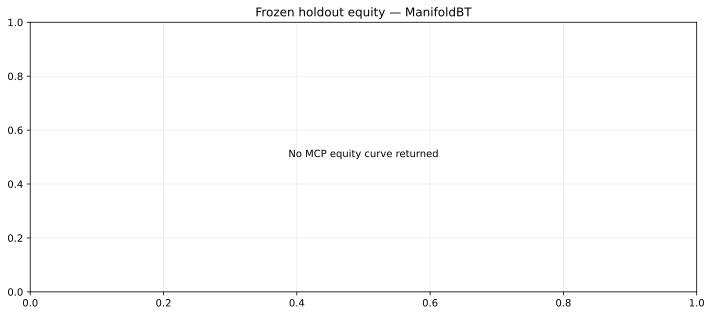
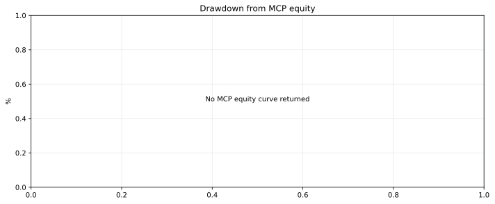
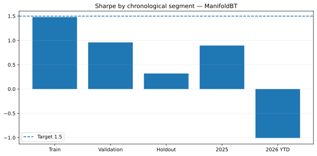
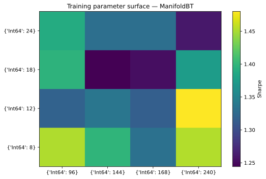
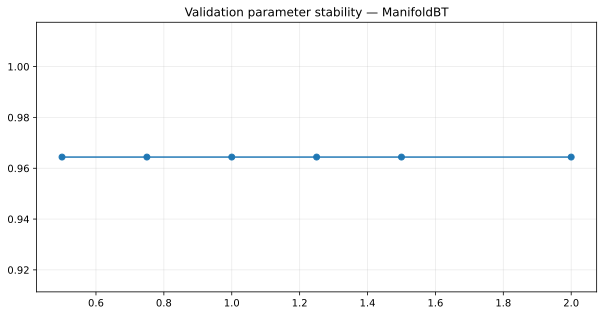
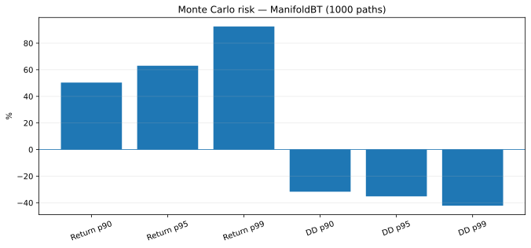

# Alpha Research — ManifoldBT MCP only

Every market calculation in the active pipeline is executed by the remote **ManifoldBT MCP engine**. Python only orchestrates the MCP calls, preserves the raw payloads and renders SVG files from the numerical series returned by ManifoldBT.

The previous `yfinance`/scikit-learn multi-asset engine is no longer part of the active research path.

## Current reviewed result — 23 July 2026

ManifoldBT Community 0.14.0 selected the `return_vol_long_cash` family on BTCUSDT, ETHUSDT, SOLUSDT, BNBUSDT and XRPUSDT using 4-hour bars.

| Period | Sharpe | Return | Max drawdown | Trades |
|---|---:|---:|---:|---:|
| Train 2021–2023 | 1.480 | +359.19% | -46.43% | 271 |
| Validation 2024 | 0.959 | +26.27% | -25.31% | 96 |
| Frozen holdout 2025–1 Jul 2026 | **0.320** | +7.14% | -22.81% | 130 |
| 2025 | 0.895 | +21.01% | -13.40% | 76 |
| 2026 YTD | **-1.007** | **-4.90%** | -7.31% | 30 |

**Decision: rejected.** The required net holdout Sharpe of 1.5 is not reached and the 2026 subperiod is negative.

Frozen parameters: `fast=12`, `slow=240`, `vol_window=120`, `risk_z=1.25`, `base_long=0.15`, `risk_long=0.15`, with no short exposure.

## Manifold-derived plots

These SVG files are rendered only from ManifoldBT MCP payloads. The complete source payload is committed as [`results/manifold/raw.json`](results/manifold/raw.json).

### Frozen holdout equity

### Frozen holdout drawdown

### Sharpe by chronological period

### Training parameter surface

### Validation parameter stability

The tested `risk_z` values all returned approximately 0.964 validation Sharpe. That flat line is not automatically proof of robustness; it may mean the parameter did not materially alter positions over this validation window.

### Monte Carlo risk

Manifold's 1,000-path block bootstrap reports:

- mean terminal return: +11.32%;
- `prob_of_ruin`: 39.9%;
- 95th-percentile maximum drawdown: 35.20%;
- 99th-percentile maximum drawdown: 42.19%;
- no wipeout observed in 1,000 paths, which must not be read as zero wipeout risk.

## What actually comes from ManifoldBT

- strategy validation;
- symbol discovery from the server datastore;
- parameter sweeps and overfitting correction;
- train, validation and frozen holdout backtests;
- equity curve and daily returns;
- two-dimensional parameter surface;
- parameter stability analysis;
- Monte Carlo risk simulation.

The CI runs Ruff, compilation and tests on Python 3.11 and 3.12. The research workflow uploads a complete artifact; committing a new result snapshot remains a reviewed, explicit action rather than an automatic bot mutation.

## Real blocking limitations

- The server reports the **Community** licence and refuses native `run_walk_forward`, which requires Pro.
- The exposed MCP toolset has no `ingest_data`, so this pipeline cannot add equities, futures or custom datasets.
- The preloaded datastore contains 50 Binance **CryptoSpot** proxies, not complete perpetual-contract history.
- Historical funding, basis, open interest and liquidation data are unavailable.
- Community Monte Carlo is capped at 1,000 paths.
- The `binance_perps` fee preset can model fees, but it does not turn spot proxy bars into genuine perpetual-market data.

The chronological train/validation/holdout split is genuinely separated, but it is orchestrated through independent MCP calls rather than ManifoldBT's native Pro walk-forward engine.
