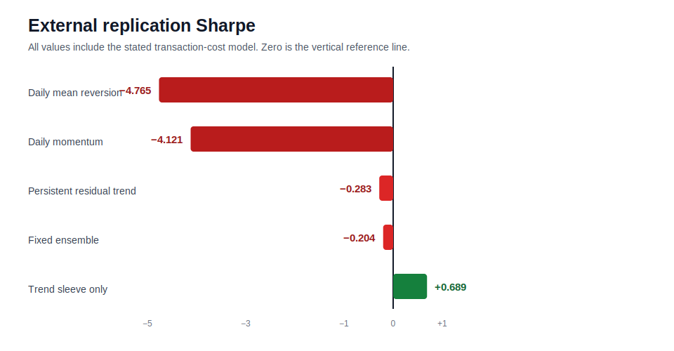

# Alpha Research

This repository records systematic strategy research with explicit rejection gates. It does not promote a strategy merely because one backtest is positive.

## Current reviewed result — 23 July 2026

The active research cycle moved beyond the ManifoldBT-only crypto dataset and evaluated **118 unique liquid ETFs** across equities, international markets, rates, credit, commodities, currencies, sectors, themes and styles.

Four increasingly conservative experiments were completed:

| Experiment | External observations | Trades | Sharpe | Alpha t-stat | SPY beta | Decision |
|---|---:|---:|---:|---:|---:|---|
| Daily residual mean reversion | 389 | 1,551 | -4.765 | -6.20 | 0.008 | Rejected |
| Daily residual momentum on different ETFs | 388 | 2,856 | -4.121 | -5.08 | -0.011 | Rejected |
| Persistent turnover-aware residual strategies | 388 | 1,252 | -0.283 | -0.58 | 0.049 | Rejected |
| Fixed multi-premia ensemble | 388 | 1,959 | -0.204 | -0.51 | 0.028 | Rejected |

The sample-size objection is resolved: the final conclusions are based on thousands of instrument trades and approximately 388–389 daily portfolio observations. Inference uses daily returns with HAC standard errors and block bootstrap rather than falsely treating simultaneous positions as independent samples.

**Final decision: no statistically validated alpha was found. Live deployment is prohibited.**

Read the complete reviewed report: [`CROSS_ASSET_RESULTS.md`](CROSS_ASSET_RESULTS.md).

## Active cross-asset infrastructure

- resilient market-data loading with London Strategic Edge CSV/Parquet and API hooks;
- public adjusted-data fallback with recorded per-symbol provenance;
- 51-ETF development universe and separate 68-ETF replication universe;
- class, dollar and rolling SPY-beta neutralisation;
- causal signal tests and one-day execution lag;
- transaction costs applied to actual turnover;
- expanding walk-forward folds;
- HAC/Newey-West alpha statistics;
- block-bootstrap significance;
- multiple-testing correction for searched families;
- doubled-cost, extra-delay and inverted-signal stress tests;
- CI on Python 3.11 and 3.12.

## Research rule after this review

The inspected 2025–2026 range must not be reused as a new untouched holdout. Future work needs either:

- data arriving after the frozen research date;
- a genuinely independent dataset with different information content;
- or a new hypothesis defined before its evaluation.

Relevant next datasets include futures term structure, carry, funding, basis, options volatility surfaces and macro-release surprises. Parameter tuning against the current ETF window is explicitly disallowed.

## Historical ManifoldBT research

The earlier ManifoldBT-only crypto research is retained for auditability under [`MANIFOLD_RESULTS.md`](MANIFOLD_RESULTS.md) and `results/manifold/`. It was rejected because the holdout Sharpe was 0.320, 2026 was negative and the available dataset lacked the breadth and market information needed for the requested alpha objective.
